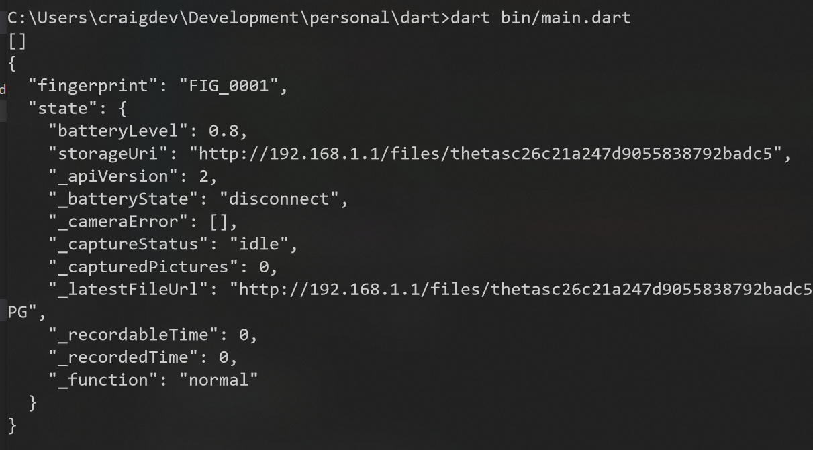
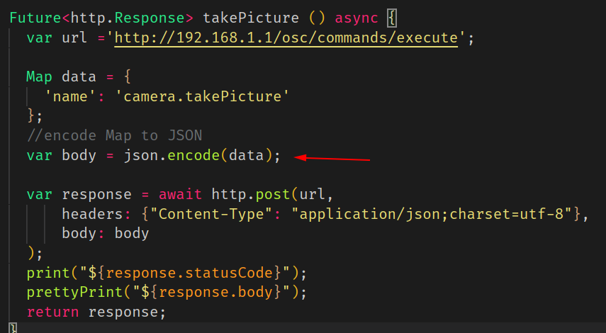
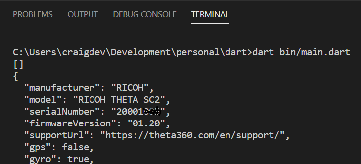

# RICOH THETA SC2 API Tests Using Public Information

RICOH THETA API requests for SC2. Based on community tests
of the public
[API reference](https://api.ricoh/docs/theta-web-api-v2.1/) for V and Z1.
These tests do not use SC2 API documentation as the SC2 API is not listed
as a supported camera on the public documentation.

The SC2 API differs from the API for the V and Z1.  See 
[this](https://theta360.guide/special/sc2/) site for
more information.

As of July 16, 2020, these are the known issues with the SC2 API:

* listFiles does not return thumbnails even if the parameters are set for thumbnails
* RICOH SDK does not work reliably with livePreview frames. Will stop of EOF exception
* livePreview stops when certain commands are issued to the SC2
* getMetaData does not return correct values
* status cannot be used with startCapture. 

See the site and written guide for more information.

The SC2 API is similar to the Z1 API.

Additional information is on the [blog](https://codetricity.github.io/sc2-public-code-examples/)


## Configuration and Installation

1. install [dart](https://dart.dev/)
2. clone this repo
3. run `pub get` to install dependencies

```
$ pub get
Resolving dependencies... (1.2s)
Downloading args 1.5.3...
Downloading http 0.12.0+4...
Downloading pedantic 1.9.0...
Downloading async 2.4.0...
Downloading source_span 1.6.0...
Downloading charcode 1.1.3...
Downloading meta 1.1.8...
Got dependencies!
```


## Usage

1. connect workstation to THETA with camera in access point (AP) mode
2. run `main.dart` file in `bin` with the appropriate command


### Example with info

     dart bin/main.dart info

Instead of info, you can also use other commands:

### Example with state

    dart bin/main.dart state

Working commands:

* info
* state
* takePicture
* listFiles
* getOptions
* downloadFile
* getMetadata
* firmware - prints firmware version and camera model
* downloadReady - takes pictures and checks if picture is ready for download
* takeAndDownload - take picture and download using osc/state to get file URL
* setExposureDelayFive - set self-timer to five
* setExposureDelayZero - turn off self-timer
* setHdr - [public API reference](https://api.ricoh/docs/theta-web-api-v2.1/options/_filter/)

## Explanation

### POST example

response from THETA SC2




### Take Picture Example

If you send a payload such as `{'name': 'camera.takePicture'}` as part of your 
request, you must encode the body as JSON.  You can use `json.encode(your-payload-object)` 
or the new `jsonEncode()` https://api.dart.dev/stable/2.7.1/dart-convert/jsonEncode.html





Test from THETA SC2.  OK!

Response from SC2 shown below.

```javascript
C:\Users\craigdev\Development\personal\dart>dart bin/main.dart
[]
200
{
  "name": "camera.takePicture",
  "id": "1588",
  "progress": {
    "completion": 0.0
  },
  "state": "inProgress"
}
```

### List Files

https://api.ricoh/docs/theta-web-api-v2.1/commands/camera.list_files/

This shows a more complex nested payload with parameters.

Response

```javascript
$ dart bin/main.dart 
[]
200
{
  "name": "camera.listFiles",
  "results": {
    "entries": [
      {
        "dateTimeZone": "2020:03:18 17:12:32-07:00",
        "fileUrl": "http://192.168.1.1/files/150100525831424d42079d18e0b6c300/100RICOH/R0010024.JPG",
        "height": 2688,
        "isProcessed": true,
        "name": "R0010024.JPG",
        "previewUrl": "",
        "_projectionType": "Equirectangular",
        "size": 4362617,
        "_thumbSize": 2749,
        "width": 5376
      },
```
### Get Options

The camera options you want to get need to be specified individually in an array.
I do not think you can get all the options with a wildcard or "all" specification.

Format of the data request is below.

```javascript
var url ='http://192.168.1.1/osc/commands/execute';

  Map data = {
    'name': 'camera.getOptions',
    'parameters': {
      'optionNames': [
        "iso",
        "isoSupport"
      ]
    }
```

Response from a THETA SC2 running firmware 1.20 is shown below.

```javascript
{
  "name": "camera.getOpions",
  "state": "done",
  "results": {
    "options": {
      "iso": 0,
      "isoSupport": [
        64,
        80,
        100,
        125,
        160,
        200,
        250,
        320,
        400,
        500,
        640,
        800,
        1000,
        1250,
        1600,
        2000,
        2500,
        3200
      ]
    }
  }
}
```


## Camera Firmware Tested

* Z1 1.31.1
* RICOH THETA SC 1.20
* V 3.21.1




## Troubleshooting Camera

### Testing Connection with GET info

The simplest command to the camera is GET info.

You can test it in a browser, curl, Postman.  In the test program, you can
look for the URL below.

    String url = 'http://192.168.1.1/osc/info';

If you are having problems getting a camera connection and want to test your
code with a known working API that returns a single JSON object, you can use a public Internet test server to return a single JSON object and print it out.

    // String url = 'https://swapi.co/api/people/1';
    // String url = 'https://jsonplaceholder.typicode.com/users/1';

---


Read about [why we're using Dart](docs/dart-growth/dart.md).
